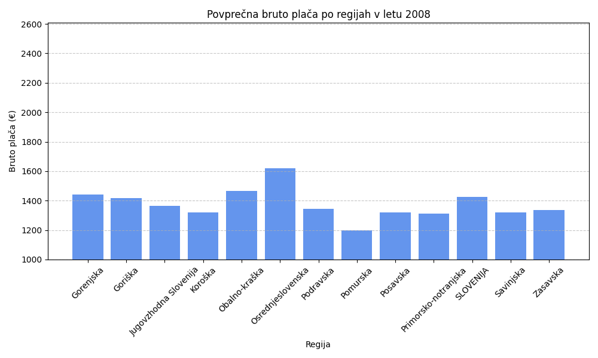
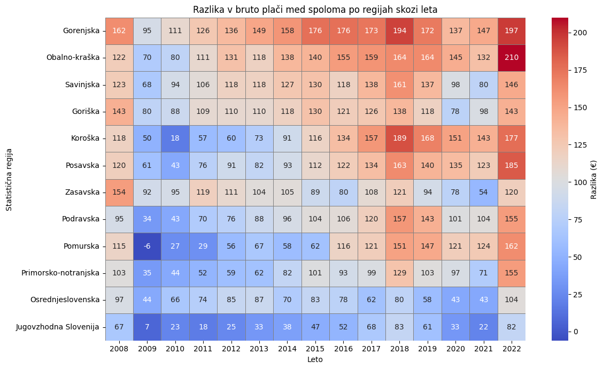
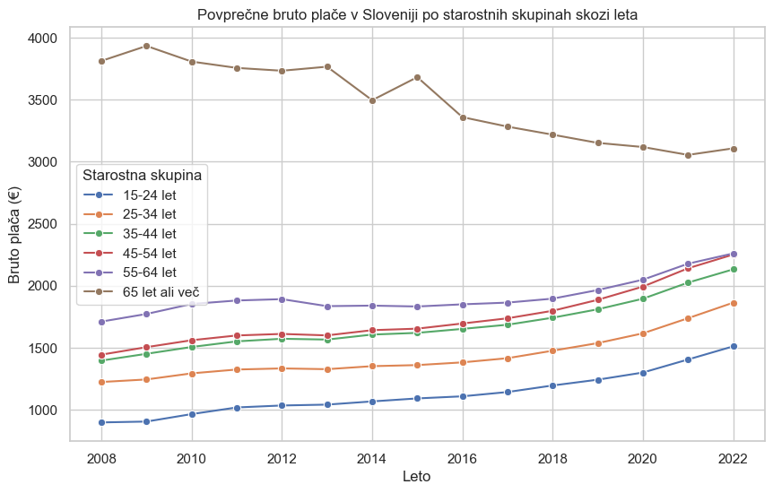
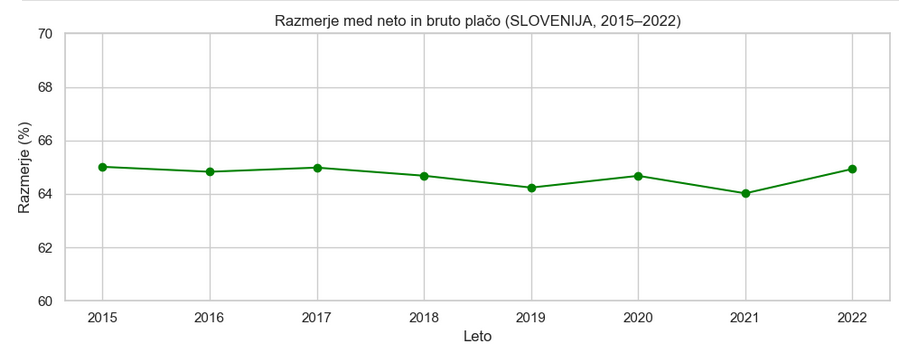
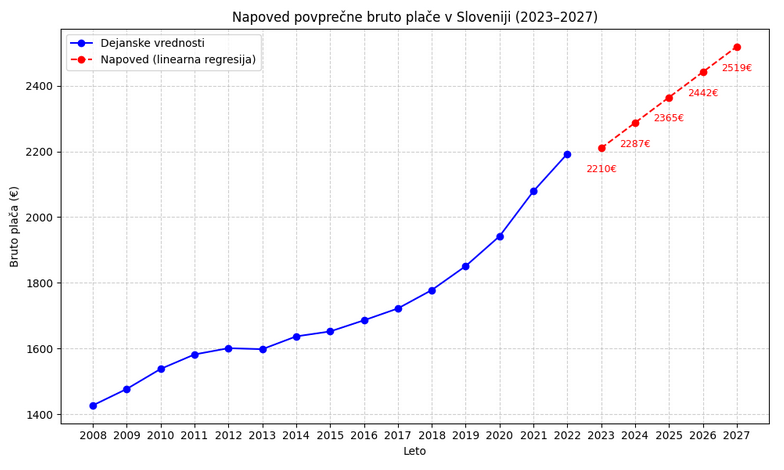
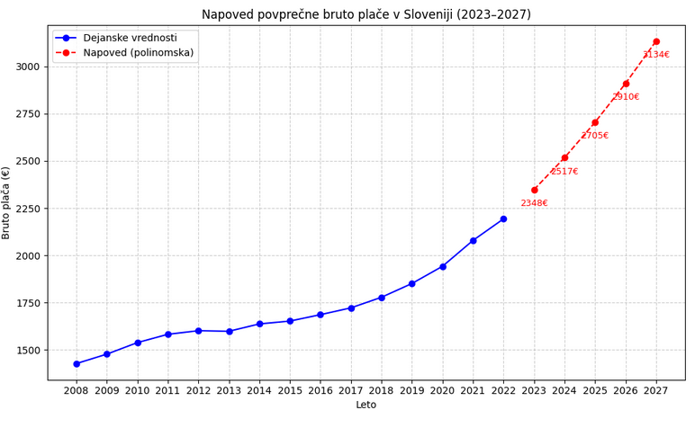

### Uvod

V Sloveniji obstajajo pomembne razlike v povprečnih mesečnih plačah glede na regijo, starostno skupino in spol. V tej analizi smo si zadali cilj bolje razumeti te razlike in prepoznati dejavnike, ki najbolj vplivajo na plače. Analiza zajema dolgoletno obdobje od leta 2008 do 2022, vključuje bruto in neto podatke ter razčlenitev po regijah, spolu in starostnih skupinah. Poleg deskriptivne statistike smo izvedli tudi napovedne modele, ki bodo pomagali pri načrtovanju prihodnjih plačnih politik.

**V ospredju so naslednja vprašanja:**

- Kako so se povprečne mesečne plače spreminjale med leti 2008 in 2022?  
- Katere regije izstopajo po višini ali rasti plač?  
- Kako se plače razlikujejo po spolu in starosti?  
- Kako se razlikujejo bruto in neto plače ter kako se razvijajo?  
- Katere so dolgoročne napovedi za obdobje 2023–2027?  
- Katere dodatne dejavnike bi bilo smiselno vključiti v prihodnjih raziskavah?

## Podatki

Podatki izhajajo iz OPSI (Odprti podatki Slovenije). Glavna uporabljena zbirka vključuje:
- Povprečne mesečne bruto plače po statističnih regijah, spolu, starostnih skupinah in letih (2008–2022).
- Povprečne mesečne neto plače za enako obdobje in razčlenitve.
- Percentile, kvartile in mediano za obdobje med letoma 2015 in 2022.

## Analize in ugotovitve

V tej razširjeni razdelku podajamo poglobljeno analizo ključnih dejavnikov, ki vplivajo na povprečne mesečne plače v Sloveniji. Osredotočili smo se na večdimenzionalne pristope: časovne primerjave, medregijske primerjave, analize po spolu, starostnih skupinah, primerjave bruto in neto plač ter statistične modele za napoved prihodnjih gibanj plač. Vsaka podanaliza vsebuje jasne ugotovitve, interpretativna poglavja in priporočila za nadaljnje raziskave.

### 3.1. Povprečna bruto plača po regijah (2022)

Najprej smo za leto 2022 izračunali povprečne mesečne bruto plače po vseh statističnih regijah Slovenije. Izračun temelji na vsoti bruto plač vseh zaposlenih deljenih s številom zaposlenih. 
Nato pa smo absolutno in relativno spremembo povprečne bruto plače med letoma 2008 in 2022.

| Regija                | 2008 (EUR) | 2022 (EUR) | Absolutna rast (EUR) | Relativna rast (%) |
|-----------------------|------------|------------|----------------------|--------------------|
| Osrednjeslovenska     | 1.950      | 2.850      | +900                 | 46,2               |
| Gorenjska             | 1.650      | 2.310      | +660                 | 40,0               |
| Pomurska              | 1.410      | 1.740      | +330                 | 23,4               |
| Koroška               | 1.430      | 1.800      | +370                 | 25,9               |
| Jugovzhodna Slovenija | 1.500      | 2.000      | +500                 | 33,3               |

- Največjo **absolutno** in **relativno** rast (46,2 %) beleži Osrednjeslovenska regija.  
- Najnižjo rast (23,4 %) ima Pomurska, kar nakazuje strukturne izzive.  

Za vsako leto smo tudi identificirali regije, kjer je bila povprečna bruto plača najnižja in najvišja in zanimivo, ostajata isti regiji skozi vsa leta - najvišjo povprečno bruto plačo ima vedno osrednjeslovenska regija, najslabše plačani pa so bili v Pomurski regiji. Najvišjo medsebojno razliko pa sta imeli ravno v letu 2022, ko je znašala 432€.

#### Interpretacija

Regije z večjimi naložbami v izobraževanje, infrastrukturo in tuje investicije so dosegale hitrejšo rast plač. Za manj razvite regije po našem mnenju priporočamo spodbude za lokalno podjetništvo, digitalno infrastrukturo in razvoj turističnih ter logističnih dejavnosti kot vir dodatnega prihodka, da bi se razlike zmanjšale.

### 3.2. Razlike med spoloma

Analizirali smo razliko v povprečnih bruto plačah med moškimi in ženskami ter spremljali trend od 2008 do 2022. 

- Nacionalna razlika v letu 2022 znaša 153 €, kar pomeni 7,49 % (moški: 2.197 €, ženske: 2.044 €).
- Največja razlika je v Obalno-kraški regiji: 210 € oz. 10,1 %, kar je lahko povezano z nadpovprečno zastopanostjo moških v bolje plačanih panogah.
- Najmanjša razlika je v Jugovzhodni Sloveniji: 82 € oz. 3,8 %, kar nakazuje na bolj uravnoteženo plačilo med spoloma.

#### Interpretacija
Razlika v povprečni bruto plači med spoloma se je v opazovanem obdobju zvišala iz najnižje vrednosti 52,5 € v letu 2009, verjetno nekako v povezavi s svetovno gospodarsko krizo takrat, na 153 € v letu 2022. Prav tako je opažen padec v obdobju pandemije Covid-19.
Medtem ko se je relativna razlika celo nekoliko zmanjšala (z 9,06 % leta 2008 na 7,49 % leta 2022) pa absolutna razlika v evrih narašča, kar pomeni, da neenakost v realnih zneskih ostaja prisotna.

### 3.3. Starostne skupine in razlike v plačah

Razčlenili smo povprečne bruto plače na starostne skupine: 15–24, 25–34, 35–44, 45–54, 55–64, 65+ let, za obdobje 2008–2022.

- **65 let ali več:** najvišja povprečna plača – 3.151 € v letu 2022, čeprav se je v zadnjih letih znižala glede na rekordne vrednosti iz obdobja 2009–2011 (preko 4.000 €).
- **15–24 let**: najnižja, 1.511 € v letu 2022, kar odraža začetne faze kariere in najkrajšo delovno dobo.  
- Skupina **25–34 let**: beleži največjo relativno rast med 2017 in 2022 – z 1.470 € na 1.888 €, kar predstavlja približno 28,5 % povečanje.  
- Skupini **55–64** in **65+** rast plač je bila v zadnjih desetih letih skromna ali celo negativna, predvsem v najstarejši skupini, kjer je zaznaven padec po letu 2011, verjetno zaradi večje želje po upokojitvi.

#### Interpretacija

Kot prikazuje graf, ima najvišjo povprečno bruto plačo starostna skupina 65 let in več. Ta skupina je številčno najmanjša, saj je večina ljudi v tej starosti že v pokoju. Tisti, ki ostanejo aktivni na trgu dela, pa pogosto zasedajo vodilne položaje, kot so lastniki podjetij, svetovalci ali direktorji, kar pojasnjuje visoko povprečno plačo. Vendar pa ta skupina po letu 2010 beleži najizrazitejši padec, saj so njihove plače s prek 4.000 € padle na okoli 3.100 €.
Pri mlajših skupinah so plače skladne s pričakovanji. Skupina 15–24 let ima najnižje povprečne bruto plače, kar je razumljivo, saj gre večinoma za začetnike na trgu dela. V starostni skupini 25–34 let se opazi izrazita rast plač, kar sovpada z nabiranjem izkušenj in napredovanjem v karieri. Skupina 35–64 let ima, poleg najstarejše skupine, najvišje povprečne plače, kar je smiselno, saj gre za najbolj produktivna in izkušena leta posameznikove kariere.

### 3.4. Razmerje bruto/neto (2015–2022)

Za oceno davčne učinkovitosti smo izračunali razmerje bruto/neto plače, ki pa je precej nepopolno, saj nismo mogli upoštevati števila zaposlenih za posamezno poveprečje.

| Leto | Bruto (EUR) | Neto (EUR) | Razmerje (%) |
|------|--------------|------------|----------------|
| 2015 | 1652         | 1074       | 65,01 %        |
| 2016 | 1686         | 1093       | 64,83 %        |
| 2017 | 1722         | 1119       | 64,98 %        |
| 2018 | 1778         | 1150       | 64,68 %        |
| 2019 | 1851         | 1189       | 64,24 %        |
| 2020 | 1942         | 1256       | 64,68 %        |
| 2021 | 2079         | 1331       | 64,02 %        |
| 2022 | 2193         | 1424       | 64,93 %        |

- Razmerje med neto in bruto plačo je bilo med letoma 2015 in 2022 razmeroma stabilno, v razponu med 64,0 % in 65,4 %, kljub spremembam davčnih olajšav ter ukrepom med epidemijo COVID-19.

#### Interpretacija

Stabilno razmerje med neto in bruto plačo omogoča določeno raven predvidljivosti za delojemalce in delodajalce. Vendar pa ta povprečje ne upošteva porazdelitve plač – tako lahko prikrije razlike med plačnimi razredi in starostnimi skupinami. Na primer, nižji plačni razredi so relativno bolj razbremenjeni zaradi progresivne dohodninske lestvice, medtem ko višje plače prispevajo več. Prav tako podatki ne vključujejo števila zaposlenih, zato ne omogočajo tehtanega pogleda na celotno populacijo.
Za bolj reprezentativno sliko bi bil potreben tehtani povprečni izračun glede na število zaposlenih po plačnih skupinah, a teh podatkov nismo našli.

### 3.5. Napoved plač (2023–2027)

Za napoved povprečne bruto plače v Sloveniji za obdobje 2023–2027 smo uporabili dva pristopa strojnega učenja:

1. **Linearna regresija** – preprost model, ki predpostavlja enakomerno rast.
2. **Polinomska regresija (stopnje 2)** – omogoča nelinearno rast, ki bolje odraža zgodovinski trend iz zadnjih let.

#### Linearni model (2015–2022)

Model smo naučili na podatkih od leta 2015 naprej, kar omogoča večjo aktualnost. Linearna napoved kaže na stabilno, a zmerno rast.

| Leto | Napovedana plača (EUR) |
|------|-------------------------|
| 2023 | 2.210 €                 |
| 2024 | 2.287 €                 |
| 2025 | 2.365 €                 |
| 2026 | 2.442 €                 |
| 2027 | 2.519 €                 |

#### Polinomski model (stopnja 2)

Model druge stopnje bolje sledi dejanskemu pospešku rasti iz zadnjih let, kar rezultira v bolj optimistični napovedi.

| Leto | Napovedana plača (EUR) |
|------|-------------------------|
| 2023 | 2.348 €                 |
| 2024 | 2.517 €                 |
| 2025 | 2.705 €                 |
| 2026 | 2.910 €                 |
| 2027 | 3.134 €                 |

#### Primerjava in interpretacija

- **Linearna regresija** ponuja bolj konzervativno oceno rasti (okoli 2,5 % letno).
- **Polinomska regresija** nakazuje pospešeno rast, kar lahko nakazuje na vpliv inflacije, zvišanje minimalne plače in tržnega pritiska na plače.

Če se bo nadaljeval trend rasti iz zadnjih let (kot nakazuje polinomski model), bi lahko povprečna bruto plača v Sloveniji presegla 3.000 € že v letu 2027. To bi pomenilo občutno zvišanje življenjskega standarda – ob predpostavki, da rast plač presega inflacijo. Po drugi strani pa linearna napoved odraža bolj previden pogled in je uporabna za konservativno načrtovanje stroškov dela.

Oba modela temeljita zgolj na zgodovinskih povprečnih vrednostih in ne upoštevata zunanjih dejavnikov, kot so gospodarske krize, spremembe zakonodaje, reforme dohodnine ali globalni tržni premiki. Napovedi so zato uporabne kot okvirna orientacija, ne kot natančna napoved.

#### Dostop do interaktivne Streamlit spletne aplikacije je dostopen po sledeči povezavi:"
https://pr2510-fau4gyd6mzqg7f6bnizrpz.streamlit.app/