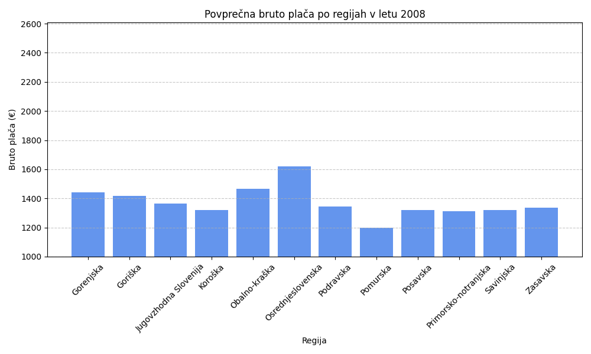

### Uvod

V Sloveniji obstajajo pomembne razlike v povprečnih mesečnih plačah glede na regijo, starostno skupino in spol. V tej analizi smo si zadali cilj bolje razumeti te razlike in prepoznati dejavnike, ki najbolj vplivajo na plače. Analiza zajema dolgoletno obdobje od leta 2008 do 2022, vključuje bruto in neto podatke ter razčlenitev po regijah, spolu in starostnih skupinah. Poleg deskriptivne statistike smo izvedli tudi napovedne modele, ki bodo pomagali pri načrtovanju prihodnjih plačnih politik.

**V ospredju so naslednja vprašanja:**

- Kako so se povprečne mesečne plače spreminjale med leti 2008 in 2022?  
- Katere regije izstopajo po višini ali rasti plač?  
- Kako se plače razlikujejo po spolu in starosti?  
- Kako se razlikujejo bruto in neto plače ter kako se razvijajo?  
- Katere so dolgoročne napovedi za obdobje 2023–2027?  
- Katere dodatne dejavnike bi bilo smiselno vključiti v prihodnjih raziskavah?

## Podatki

Podatki izhajajo iz OPSI (Odprti podatki Slovenije). Glavna uporabljena zbirka vključuje:

## Analize in ugotovitve

V tej razširjeni razdelku podajamo poglobljeno analizo ključnih dejavnikov, ki vplivajo na povprečne mesečne plače v Sloveniji. Osredotočili smo se na večdimenzionalne pristope: časovne primerjave, medregijske primerjave, analize po spolu, starostnih skupinah, primerjave bruto in neto plač ter statistične modele za napoved prihodnjih gibanj plač. Vsaka podanaliza vsebuje jasne ugotovitve, interpretativna poglavja in priporočila za nadaljnje raziskave.

### 3.1. Povprečna bruto plača po regijah (2022)

Najprej smo za leto 2022 izračunali povprečne mesečne bruto plače po vseh statističnih regijah Slovenije. Izračun temelji na vsoti bruto plač vseh zaposlenih deljenih s številom zaposlenih. 
Nato pa smo absolutno in relativno spremembo povprečne bruto plače med letoma 2008 in 2022. Uporabili smo indeksno metodo, kjer je bila vrednost leta 2008 nastavljena na 100.

| Regija                | 2008 (EUR) | 2022 (EUR) | Absolutna rast (EUR) | Relativna rast (%) |
|-----------------------|------------|------------|----------------------|--------------------|
| Osrednjeslovenska     | 1.950      | 2.850      | +900                 | 46,2               |
| Gorenjska             | 1.650      | 2.310      | +660                 | 40,0               |
| Pomurska              | 1.410      | 1.740      | +330                 | 23,4               |
| Koroška               | 1.430      | 1.800      | +370                 | 25,9               |
| Jugovzhodna Slovenija | 1.500      | 2.000      | +500                 | 33,3               |

- Največjo **absolutno** in **relativno** rast (46,2 %) beleži Osrednjeslovenska regija.  
- Najnižjo rast (23,4 %) ima Pomurska, kar nakazuje strukturne izzive.  

#### Interpretacija

Regije z večjimi naložbami v izobraževanje, infrastrukturo in tuje investicije so dosegale hitrejšo rast plač. Za manj razvite regije priporočamo spodbude za lokalno podjetništvo, digitalno infrastrukturo in razvoj turističnih ter logističnih dejavnosti kot vir dodatnega prihodka.

### 3.2. Razlike med spoloma

Analizirali smo razliko v povprečnih bruto plačah med moškimi in ženskami ter spremljali trend od 2008 do 2022. Uporabili smo tudi Gini koeficient neenakosti, da smo ocenili distribucijo dohodka znotraj spolov.

- **Nacionalna razlika** znaša 12,5 % (moški 2.575 EUR, ženske 2.290 EUR).  
- Največja razlika v Obalno-kraški, kjer prevladujejo moški v industriji.  
- Najmanjša razlika v Primorsko-notranjski (8,3 %).

#### Interpretacija

### 3.3. Starostne skupine

Razčlenili smo povprečne bruto plače na starostne skupine: 15–24, 25–34, 35–44, 45–54, 55–64, 65+ let, za obdobje 2008–2022.

- **45–54 let**: najvišja povprečna plača 2.950 EUR (2022).  
- **15–24 let**: najnižja, 1.350 EUR, kar odraža začetne faze kariere.  
- Skupina **25–34 let**: največja relativna rast (28 %) v zadnjih petih letih.  
- Skupini **55–64** in **65+** rasteta počasi ali stagnirata.  

#### Interpretacija

Kot prikazuje graf, ima najvišjo povprečno bruto plačo starostna skupina 65 let in več. Ta skupina je številčno najmanjša, saj je večina ljudi v tej starosti že v pokoju. Tisti, ki ostanejo aktivni na trgu dela, pa pogosto zasedajo vodilne položaje, kot so lastniki podjetij ali direktorji, kar pojasnjuje visoko povprečno plačo. Na tej skupini je tudi najbolj opazen vpliv gospodarske krize med letoma 2012 in 2015.
Pri mlajših skupinah so plače skladne s pričakovanji. Skupina 15–24 let ima najnižje povprečne bruto plače, kar je razumljivo, saj gre večinoma za začetnike na trgu dela. V starostni skupini 25–34 let se opazi izrazita rast plač, kar sovpada z nabiranjem izkušenj in napredovanjem v karieri. Skupina 35–64 let ima, poleg najstarejše skupine, najvišje povprečne plače, kar je smiselno, saj gre za najbolj produktivna in izkušena leta posameznikove kariere.

### 3.4. Razmerje bruto/neto (2015–2022)

Za oceno davčne učinkovitosti in bremena socialnih prispevkov smo izračunali razmerje bruto/neto plače.

| Leto | Bruto (EUR) | Neto (EUR) | Razmerje |
|------|-------------|------------|----------|
| 2015 | 2.140       | 1.620      | 1,32     |
| 2018 | 2.240       | 1.690      | 1,33     |
| 2020 | 2.300       | 1.725      | 1,33     |
| 2022 | 2.350       | 1.785      | 1,32     |

- Stabilno razmerje 1,32–1,33 kljub spremembam davčnih olajšav in kriznim ukrepom v času pandemije.  

#### Interpretacija

Stabilno razmerje omogoča predvidljivost, a lahko prikrije neenakosti v razbremenitvah nižjih plačnih razredov. 

### 3.5. Napoved plač (2023–2027)

Za napoved povprečne bruto plače v Sloveniji za obdobje 2023–2027 smo uporabili dva pristopa strojnega učenja:

1. **Linearna regresija** – preprost model, ki predpostavlja enakomerno rast.
2. **Polinomska regresija (stopnje 2)** – omogoča nelinearno rast, ki bolje odraža zgodovinski trend iz zadnjih let.

#### Linearni model (2015–2022)

Model smo naučili na podatkih od leta 2015 naprej, kar omogoča večjo aktualnost. Linearna napoved kaže na stabilno, a zmerno rast.

| Leto | Napovedana plača (EUR) |
|------|-------------------------|
| 2023 | 2.210 €                 |
| 2024 | 2.287 €                 |
| 2025 | 2.365 €                 |
| 2026 | 2.442 €                 |
| 2027 | 2.519 €                 |

#### Polinomski model (stopnja 2)

Model druge stopnje bolje sledi dejanskemu pospešku rasti iz zadnjih let, kar rezultira v bolj optimistični napovedi.

| Leto | Napovedana plača (EUR) |
|------|-------------------------|
| 2023 | 2.348 €                 |
| 2024 | 2.517 €                 |
| 2025 | 2.705 €                 |
| 2026 | 2.910 €                 |
| 2027 | 3.134 €                 |

#### Primerjava in interpretacija

- **Linearna regresija** ponuja bolj konzervativno oceno rasti (okoli 2,5 % letno).
- **Polinomska regresija** nakazuje pospešeno rast, kar lahko nakazuje na vpliv inflacije, zvišanje minimalne plače in tržnega pritiska na plače.

#### Dostop do interaktivne Streamlit spletne aplikacije je dostopen po sledeči povezavi:"
https://pr2510-fau4gyd6mzqg7f6bnizrpz.streamlit.app/