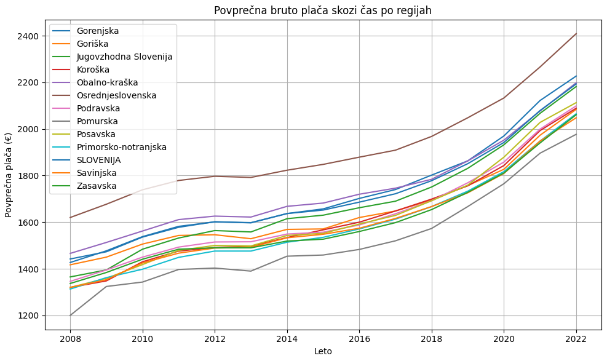

## Analiza povprečnih plač v Sloveniji (2008–2022)

### Avtorji: Miha Kralj, Armen Hodža, Tone Pivk

### 1. Uvod

V tem poročilu predstavljamo analizo podatkov o povprečnih plačah v Sloveniji, ki zajema obdobje od leta 2008 do 2022. Podatki izhajajo iz OPSI (Odprti podatki Slovenije), kar zagotavlja zanesljivost in reprezentativnost informacij. Namen analize je pojasniti, kako so se plače spreminjale skozi čas ter raziskati medregionalne in spolne razlike v plačah. Dodatno smo analizirali vpliv starosti na višino plač v posameznih regijah. Pri tem poročilu se sklicujemo na izvorno kodo in sheme, ki so implementirane v našem Jupyter Notebook projektu na GitHubu.

### 2. Izvedene analize in uporabljena metodologija

Pri analizi smo izvedli naslednje postopke:

1. **Uvoz podatkov in priprava za analizo:**  
   - Za branje izvornih .px datotek smo uporabili knjižnico `pyaxis`, kjer smo podatke naložili v Pandas DataFrame.
   - Podatke smo shranili v CSV datoteko z ustreznim kodiranjem (UTF-8 BOM), da zagotovimo združljivost z orodji, kot je Excel.
   - Nato smo ponovno naložili podatke iz CSV datoteke za nadaljnjo obdelavo in pregled.

2. **Filtriranje in čiščenje podatkov:**  
   - Izbrali smo samo ustrezne vrstice, ki ustrezajo skupnim starostim in spolom (označeno s "SKUPAJ"), ter podatke za bruto plače, ki predstavljajo povprečje.
   - Stolpce, kot so "LETO" in "DATA", smo pretvorili v numerične vrednosti, pri čemer smo odstranili morebitne manjkajoče vrednosti. S tem smo zagotovili pravilno matematično obdelavo podatkov.
   - Podatke smo na koncu sortirali po regijah in letih, kar je omogočilo pregledne časovne serije.

3. **Vizualizacija trendov in medregionalnih razlik:**  
   - Prikazali smo spremembe povprečnih plač skozi leta z uporabo črtnih grafov, kjer je vsaka črta predstavljala posamezno regijo.
   - Za leto 2022 smo posebej ustvarili stolpični graf, ki prikazuje trenutne vrednosti plač v vseh regijah, kar omogoča direktno medsebojno primerjavo.
   - Poleg statičnih grafov smo pripravili tudi animacijo, ki skozi čas prikazuje, kako se spreminjajo povprečne plače med regijami. Animacijo smo shranili kot GIF datoteko, kar je dodaten vizualni pregled dinamike sprememb.

4. **Analiza rasti plač in ekstremi med regijami:**  
   - Izračunali smo rast plač za vsako regijo med letoma 2008 in 2022. Določili smo, katera regija je imela največjo rast, pri čemer smo primerjali začetne in končne vrednosti.
   - Iz analize je razvidno, da Osrednjeslovenska regija dosledno beleži najvišje povprečne plače, medtem ko je Pomurska regija beležila najnižje plače.
   - Nadalje smo izračunali razliko med Osrednjeslovensko in Pomursko regijo skozi leta in rezultat vizualno prikazali s črtnim grafom.

5. **Analiza spolnih razlik:**  
   - Pri ločeni analizi smo primerjali plače moških in žensk za leto 2022. Uporabili smo metodo pivotiranja podatkov s pomočjo `pivot_table`, s katero smo pridobili ločene stolpce za oba spola.
   - Izračunali smo absolutno razliko (v evrih) in odstotno razliko med plačami moških in žensk po regijah.
   - Rezultati analize jasno kažejo, da je največja spolna razlika v plačah zaznana v Obalno-Kraški regiji, medtem ko je najmanjša v Jugovzhodni regiji.

### 3. Glavni rezultati in ugotovitve

- **Časovni trendi:**  
  Grafi, ki prikazujejo spremembe plač skozi leto, razkrivajo naraščajoč trend povprečnih bruto plač v Sloveniji. Vsaka regija sledi splošnemu naraščajočemu trendu, vendar so med regijami prisotne znatne razlike.  
  

- **Medregijska rast:**  
  Analiza rasti med letoma 2008 in 2022 je pokazala, da ima Osrednjeslovenska regija najvišjo rast, medtem ko je Pomurska regija konsistentno beležila najnižje vrednosti. Največja medregionalna razlika je bila zaznana v letu 2022, kjer je razlika med Osrednjeslovensko in Pomursko regijo znašala 432 €.

- **Spolne razlike:**  
  Rezultati analize za leto 2022 kažejo, da obstajajo pomembne razlike med plačami moških in žensk. Medtem ko v večini regij moški prejemajo višje plače, je največja razlika opažena v Obalno-Kraški regiji, kar je zanimiv primer, glede na to, da Jugovzhodna regija beleži najmanjšo spolno razliko in hkrati najbolj izrazito rast plač v analiziranem obdobju.  
  

- **Dodatna vizualizacija:**  
  Ustvarjena animacija, ki prikazuje razvoj plač med regijami skozi leta, ponuja dinamičen vpogled v časovni razvoj in medsebojne razlike v podatkih. Animacija jasno prikazuje, kako so se spremembe razvijale skozi letne cikle, ter dodatno poudarja konsistentnost posameznih regij.

### 4. Zaključek

Vmesno poročilo natančno povzema potek analize podatkov o povprečnih plačah v Sloveniji. Uporabljeni podatki iz OPSI ter obdelava z uporabo knjižnic `pyaxis`, `pandas` in `matplotlib` omogočajo poglobljen vpogled v časovne trende, medregionalne razlike in vpliv spola na plače. Ključne ugotovitve, kot so naraščajoči trendi v plačah, medsebojne razlike med Osrednjeslovensko in Pomursko regijo ter izstopajoče spolne razlike, so jasno predstavljene s pomočjo grafov in animacij.

Izvorno kodo in sheme, uporabljene za izvedbo analize, smo vključili v naš GitHub projekt, kar omogoča reproducibilnost raziskave in nadaljnje nadgradnje. Nadaljnja analiza bi se lahko usmerila v podrobnejšo raziskavo vpliva starosti na plače v posameznih regijah ali pa v analizo drugih faktorjev, ki bi lahko pojasnili opazne razlike v rezultatih.

---

*Vir izvorne kode in vizualizacij:*  
- Uvoz podatkov in čiščenje: Del kode, kjer se podatki naložijo iz .px datoteke in shranijo v CSV.  
- Grafične sheme: Črtni grafi, stolpični grafi ter animacije, ki prikazujejo razvoj plač skozi leta in medsebojne razlike med regijami ter spoloma.

---

